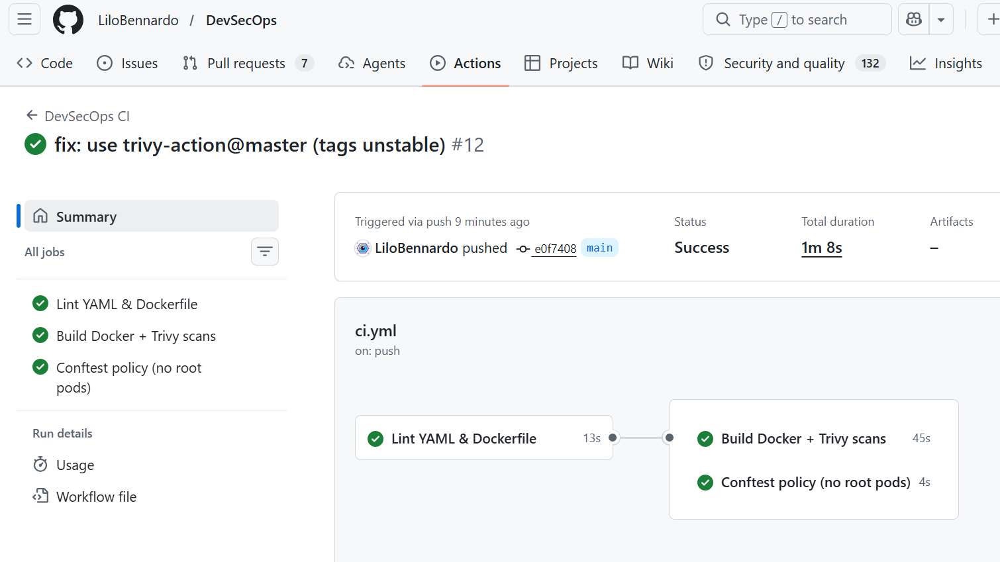
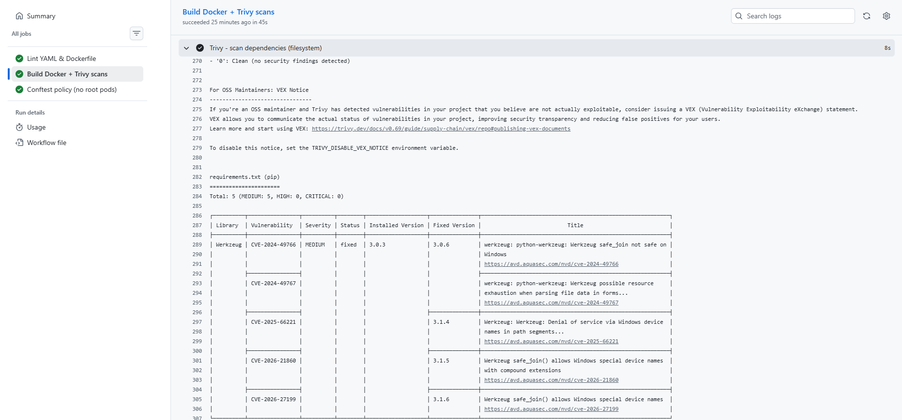
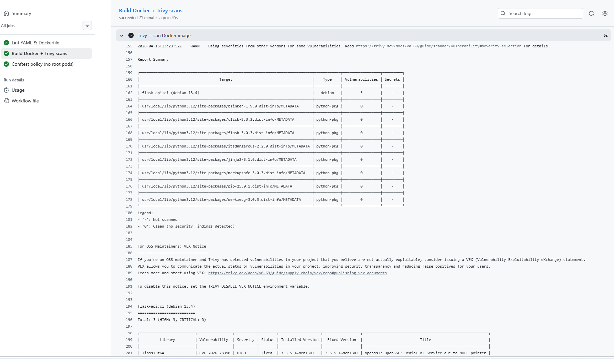
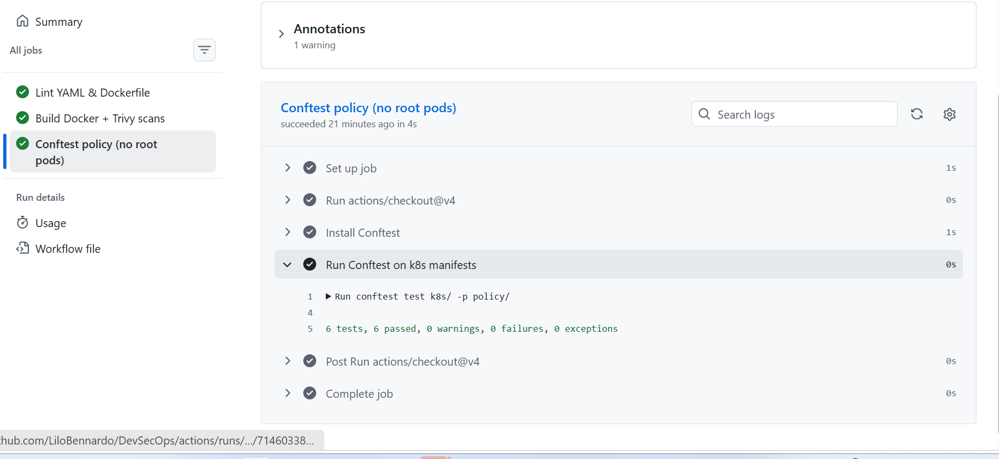
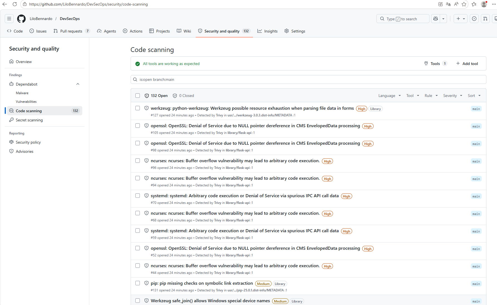
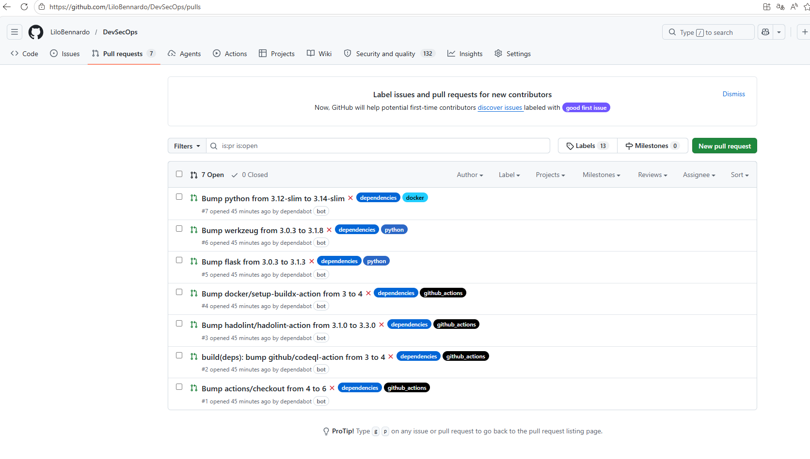

# 🔒 Projet DevSecOps — Pipeline CI/CD Sécurisé

> **Module** : 5DVSCOPS — 2025/2026  
> **Encadrant** : Laurent FREREBEAU  
> **Application** : API Flask (Python 3.12) conteneurisée + manifeste Kubernetes  

Pipeline **GitHub Actions** sécurisant le code d'une petite API Flask, intégrant scan de vulnérabilités (Trivy), linting (yamllint + hadolint), policy-as-code (Conftest/Rego) et veille automatique des dépendances (Dependabot).

---

## 📋 Table des matières

1. [Architecture du projet](#-architecture-du-projet)
2. [Pipeline CI/CD — 3 jobs](#-pipeline-cicd--3-jobs)
3. [Résultats du pipeline](#-résultats-du-pipeline)
4. [Scan de vulnérabilités](#-scan-de-vulnérabilités)
5. [Politique de sécurité (Conftest)](#-politique-de-sécurité-conftest)
6. [Centralisation des alertes (SARIF)](#-centralisation-des-alertes-sarif)
7. [Veille automatique (Dependabot)](#-veille-automatique-dependabot)
8. [Exécution locale](#-exécution-locale)
9. [Mise en route](#-mise-en-route)
10. [Difficultés rencontrées](#-difficultés-rencontrées)
11. [Recommandations](#-recommandations)

---

## 🏗 Architecture du projet

```
.
├── app.py                          # API Flask (endpoints / et /health)
├── requirements.txt                # Dépendances Python (Flask 3.0.3, Werkzeug 3.0.3)
├── Dockerfile                      # Image python:3.12-slim, utilisateur non-root (UID 10001)
├── k8s/
│   └── deployment.yaml             # Deployment + Service K8s (securityContext durci)
├── policy/
│   └── k8s_security.rego           # Règle Rego : refus des pods root
├── .github/
│   ├── workflows/
│   │   └── ci.yml                  # Pipeline GitHub Actions (3 jobs)
│   └── dependabot.yml              # Veille auto : pip + docker + github-actions
└── img/                            # Captures du pipeline
```

### Outils intégrés

| Domaine | Outil | Rôle |
|---------|-------|------|
| CI/CD | GitHub Actions | Orchestration du pipeline |
| Lint YAML | `yamllint` | Qualité des manifestes k8s et workflows |
| Lint Dockerfile | `hadolint` | Bonnes pratiques Docker |
| Scan dépendances (SCA) | `trivy fs` | CVE dans requirements.txt |
| Scan image Docker | `trivy image` | CVE dans les couches de l'image |
| Supply chain | Dependabot | MAJ auto pip / docker / actions |
| Policy-as-code | Conftest + Rego | Refus des pods root / privilèges |
| Reporting centralisé | SARIF → Security tab | Dashboard des findings GitHub |

### Sécurisation du Dockerfile

```dockerfile
FROM python:3.12-slim
WORKDIR /app
COPY requirements.txt .
RUN pip install --no-cache-dir -r requirements.txt
COPY app.py .
RUN useradd -u 10001 -m appuser
USER 10001                              # Utilisateur non-root
EXPOSE 5000
CMD ["python", "app.py"]
```

### Sécurisation du manifeste Kubernetes

```yaml
securityContext:
  runAsNonRoot: true                    # Interdit root
  runAsUser: 10001                      # UID dédié
  allowPrivilegeEscalation: false       # Pas d'élévation
  readOnlyRootFilesystem: true          # Filesystem en lecture seule
  capabilities:
    drop: ["ALL"]                       # Aucune capability Linux
```

---

## 🚀 Pipeline CI/CD — 3 jobs

Le workflow `.github/workflows/ci.yml` s'exécute sur chaque **push** et **pull request** sur `main`. Il est composé de 3 jobs séquentiels :

```
┌─────────────────────┐      ┌───────────────────────────┐
│  Lint YAML &        │ ──── │  Build Docker +           │
│  Dockerfile (13s)   │      │  Trivy scans (45s)        │
└─────────────────────┘      └───────────────────────────┘
                              │
                              │
                             ┌───────────────────────────┐
                             │  Conftest policy           │
                             │  no root pods (4s)         │
                             └───────────────────────────┘
```

| Job | Étapes | Durée |
|-----|--------|-------|
| **Lint YAML & Dockerfile** | `yamllint` (k8s/ + workflows/) + `hadolint` (Dockerfile) | 13s |
| **Build Docker + Trivy scans** | `docker build` → `trivy fs .` → `trivy image flask-api:ci` → upload SARIF | 45s |
| **Conftest policy** | `conftest test k8s/ -p policy/` — vérifie runAsNonRoot, UID ≠ 0, no privilegeEscalation | 4s |

**Durée totale : ~1 min 08 s**

---

## ✅ Résultats du pipeline

Tous les jobs passent en vert :



*Figure 1 — Run #12 : les 3 jobs (lint, build+scan, policy) passent en vert sur GitHub Actions.*

---

## 🔍 Scan de vulnérabilités

### Scan des dépendances (`trivy fs`)

Trivy analyse `requirements.txt` et remonte **6 CVE** sur les dépendances directes :

| Paquet | CVE | Sévérité | Fix |
|--------|-----|----------|-----|
| Flask 3.0.3 | CVE-2026-27205 | LOW | 3.1.3 |
| Werkzeug 3.0.3 | CVE-2024-49766 | MEDIUM | 3.0.6 |
| Werkzeug 3.0.3 | CVE-2024-49767 | MEDIUM | 3.0.6 |
| Werkzeug 3.0.3 | CVE-2025-66221 | MEDIUM | 3.1.4 |
| Werkzeug 3.0.3 | CVE-2026-21860 | MEDIUM | 3.1.5 |
| Werkzeug 3.0.3 | CVE-2026-27199 | MEDIUM | 3.1.6 |



*Figure 2 — Sortie Trivy : 5 CVE MEDIUM sur Werkzeug 3.0.3 + 1 CVE LOW sur Flask.*

### Scan de l'image Docker (`trivy image`)

L'image `flask-api:ci` (basée sur Debian 13.4) contient **124 CVE** dans les paquets OS, dont **9 HIGH** :

| Paquet | CVE | Sévérité | Description |
|--------|-----|----------|-------------|
| libssl3t64 / openssl | CVE-2026-28390 | **HIGH** | DoS via NULL pointer dans OpenSSL CMS (fix dispo) |
| libncursesw6 / libtinfo6 | CVE-2025-69720 | **HIGH** | Buffer overflow → possible RCE |
| libsystemd0 / libudev1 | CVE-2026-29111 | **HIGH** | RCE/DoS via IPC spurieux dans systemd |



*Figure 3 — Sortie Trivy : scan de l'image flask-api:ci, 3 CVE HIGH (OpenSSL, ncurses, systemd).*

### Synthèse quantitative

| Cible | Total | HIGH | MEDIUM | LOW |
|-------|-------|------|--------|-----|
| requirements.txt (pip) | 6 | 0 | 5 | 1 |
| Image Docker (debian 13.4) | 124 | **9** | 37 | 78 |
| Packages Python (image) | 8 | 0 | 6 | 2 |
| **TOTAL** | **138** | **9** | **48** | **81** |

---

## 🛡 Politique de sécurité (Conftest)

La règle Rego [`policy/k8s_security.rego`](policy/k8s_security.rego) vérifie 3 invariants sur chaque Deployment :

```rego
# 1. runAsNonRoot obligatoire
deny[msg] {
  input.kind == "Deployment"
  c := input.spec.template.spec.containers[_]
  not c.securityContext.runAsNonRoot
  msg := sprintf("Container '%s' doit definir runAsNonRoot=true", [c.name])
}

# 2. UID 0 (root) interdit
deny[msg] {
  input.kind == "Deployment"
  c := input.spec.template.spec.containers[_]
  c.securityContext.runAsUser == 0
  msg := sprintf("Container '%s' ne doit pas tourner en UID 0", [c.name])
}

# 3. allowPrivilegeEscalation interdit
deny[msg] {
  input.kind == "Deployment"
  c := input.spec.template.spec.containers[_]
  c.securityContext.allowPrivilegeEscalation == true
  msg := sprintf("Container '%s' ne doit pas autoriser allowPrivilegeEscalation", [c.name])
}
```

**Résultat : 6 tests, 6 passed, 0 failures** ✅



*Figure 4 — Conftest : la politique "no root pods" est respectée par le manifeste k8s.*

---

## 📊 Centralisation des alertes (SARIF)

Trivy génère un rapport SARIF uploadé automatiquement dans l'onglet **Security → Code scanning** de GitHub. Cela offre un dashboard centralisé de **132 alertes**, triables par sévérité et par outil :



*Figure 5 — Onglet Security : 132 alertes SARIF remontées par Trivy (HIGH + MEDIUM + LOW).*

---

## 🤖 Veille automatique (Dependabot)

Le fichier [`.github/dependabot.yml`](.github/dependabot.yml) surveille 3 écosystèmes :

- **pip** : Flask, Werkzeug (dépendances Python)
- **docker** : image de base `python:3.12-slim`
- **github-actions** : actions checkout, buildx, hadolint, codeql, trivy

Dès le premier push, **7 PR ont été ouvertes automatiquement** :



*Figure 6 — 7 PR Dependabot : bump des dépendances pip, docker et github-actions.*

---

## 💻 Exécution locale

### Prérequis

- Docker (avec buildx)
- Trivy (`sudo apt install trivy`)
- Conftest

### Lancer l'API

```bash
git clone https://github.com/LiloBennardo/DevSecOps.git
cd DevSecOps

# Build + run
docker build -t flask-api:ci .
docker run -d -p 5000:5000 --name flask flask-api:ci
sleep 2
curl localhost:5000/health
# → {"status":"healthy"}
```

### Lancer les scans

```bash
# Scan des dépendances
trivy fs .

# Scan de l'image Docker
trivy image flask-api:ci

# Politique Conftest
conftest test k8s/ -p policy/
# → 6 tests, 6 passed, 0 warnings, 0 failures, 0 exceptions
```

### Nettoyage

```bash
docker stop flask && docker rm flask
```

---

## 🚀 Mise en route

```bash
# 1. Cloner et pousser
git init
git add .
git commit -m "Initial DevSecOps pipeline"
git branch -M main
git remote add origin https://github.com/<USER>/<REPO>.git
git push -u origin main

# 2. Activer sur GitHub
# Settings → Actions → General → Allow all actions
# Settings → Code security → Dependabot alerts + security updates
# Settings → Actions → General → Workflow permissions → Read and write
```

---

## ⚠️ Difficultés rencontrées

### 1. Tag `trivy-action` inexistant

**Problème** : `Unable to resolve action aquasecurity/trivy-action@0.24.0` — le tag n'existe pas sur le repo de l'action.

**Résolution** : bascule vers `@master`, toujours résolvable. En production, pinner par SHA du commit pour la reproductibilité et la sécurité supply chain.

### 2. PR Dependabot en échec

**Problème** : les 7 PR du bot échouent toutes, alors que le pipeline sur `main` passe.

**Cause** : GitHub donne un token en **lecture seule** aux workflows Dependabot (mesure de sécurité). L'étape `upload-sarif` nécessite `security-events: write`.

**Résolution** :
- Ajout d'un bloc `permissions:` explicite au niveau workflow
- Skip conditionnel de l'upload SARIF : `if: github.actor != 'dependabot[bot]'`

### 3. Curl "Connection reset" en local

**Problème** : `curl: (56) Connection reset by peer` immédiatement après `docker run -d`.

**Cause** : Flask met ~2s à démarrer ; curl exécuté trop tôt.

**Résolution** : ajouter `sleep 2` ou une boucle `until curl -sf localhost:5000/health; do sleep 1; done`.

### 4. Plugin docker-buildx manquant

**Problème** : warning `docker-buildx: no such file or directory` sur Ubuntu.

**Résolution** : `sudo apt install docker-buildx-plugin` ou installer Docker via le dépôt officiel.

---

## 💡 Recommandations

| # | Recommandation | Priorité |
|---|---------------|----------|
| 1 | **Pinner par SHA256** (image Docker + actions) pour la sécurité supply chain | 🔴 Haute |
| 2 | **Multi-stage build** pour réduire la surface de l'image (retirer pip, apt) | 🔴 Haute |
| 3 | **Trivy en mode bloquant** (`exit-code: 1` sur CRITICAL) une fois le backlog traité | 🟠 Moyenne |
| 4 | **Signer les images** avec cosign + attestation SLSA | 🟠 Moyenne |
| 5 | **Ajouter un SAST** (Semgrep) pour les failles de logique applicative | 🟠 Moyenne |
| 6 | **NetworkPolicy** restrictive + PodSecurityStandard `restricted` | 🟡 À planifier |
| 7 | **Rebuild hebdomadaire** pour récupérer les correctifs de l'image de base | 🟡 À planifier |

### 4 règles d'or retenues

1. **Pinner par SHA, pas par tag** — Docker ET GitHub Actions
2. **Déclarer `permissions:` explicitement** dans tout workflow
3. **Tester sur une PR** avant de merger sur main
4. **HEALTHCHECK Docker** plutôt que `sleep` arbitraire

---

## 📄 Livrables

- ✅ Dépôt GitHub : [github.com/LiloBennardo/DevSecOps](https://github.com/LiloBennardo/DevSecOps)
- ✅ Pipeline : [`.github/workflows/ci.yml`](.github/workflows/ci.yml)
- ✅ Politique Conftest : [`policy/k8s_security.rego`](policy/k8s_security.rego)
- ✅ Manifeste Kubernetes durci : [`k8s/deployment.yaml`](k8s/deployment.yaml)
- ✅ Captures de logs (Figures 1 à 6)
- ✅ Rapport synthétique Word/PDF
